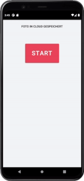

[German](README.md) | English

# Final Countdown

This App is based on the Show [_How to Sell Drugs Online (Fast)_](<https://en.wikipedia.org/wiki/How_to_Sell_Drugs_Online_(Fast)>) on [Netflix](https://en.wikipedia.org/wiki/Netflix).

## What?

In _Episode 1_ - _minute 21_ of _How to Sell Drugs Online (Fast)_, there appears an app, which is simulating to send a picture to all contacts, if the current position isn't changing in the next _2:15 min_.

## Why only in German?

Because the original Show was made in German,
and there **never** was an English version of the App,
I don't see it as necessary to make an English version.

## Current State

Currently, there is just a timer that counts down and displays random german names after that. So currently, the real position is **not** being tracked.
